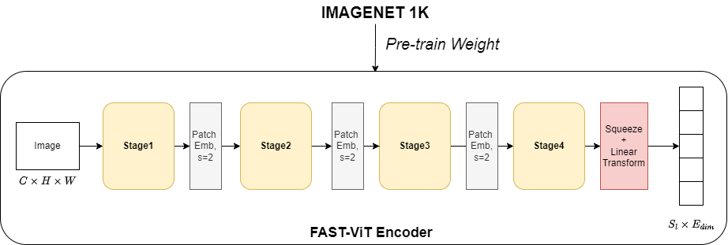

# DOcument Understanding Transformer with FastViT encoder on CORD dataset.
This project was carried out while working at VinBigdata.
My code was based on [Original Repo](https://github.com/clovaai/donut/tree/master)

This repo aim to build a new E2E model, not depend on OCR engine. 
## Theory
We experiment with Donut model, by replace Swin-Transformer encoder by FastViT encoder:

New model only has 81M params and with re-params technique, we can train on multi-branch and reference on single-branch. More information can be found at [FastViT](https://arxiv.org/abs/2303.14189)
## Installation
First, git clone this repo
``` bash
git clone https://github.com/HungVu307/fast_donut_KIE
cd fast_donut_KIE
```
After that, install libraries:
```bash
pip install -r requirement.txt
```
## For training
To train with CORD dataset:
```bash
python train.py
```
You can modify config at ```'config/train_cord.yaml'```

## For testing
To test with CORD dataset:
```bash
python test.py --pretrained_model_name_or_path 'YOUR_PATH_TO_WEIGHT'
```
## Option
If you want to train with original model, you can also replace ```donut.fastmodel``` by ```donut.model```

But note that ```donut.model``` only work with ```timm==0.5.4```
